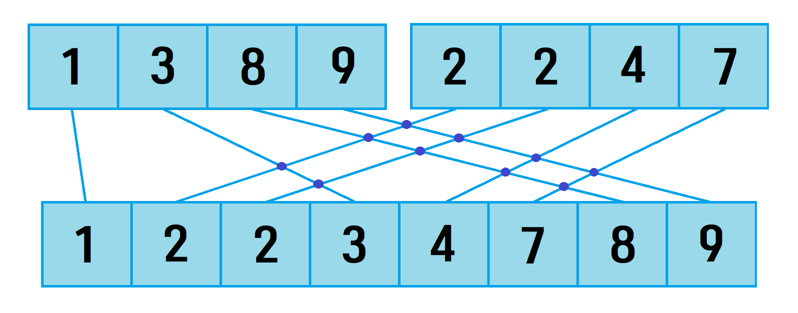

# 1517번: 버블 소트 

문제 링크: [1517번: 버블 소트](https://www.acmicpc.net/problem/1517 "bj1517")

***

## __개요__
주어진 수열에 대해 버블 소트를 수행하여 오름차순으로 정렬할 때 발생하는 Swap의 횟수, 즉 각 원소의 자리 변화의 총 횟수를 구하는 문제이다. n의 범위가 (1 ≤ n ≤ 500,000)이기 대문에 정직하게 버블 소트를 진행하며 Swap의 횟수를 세면 시간복잡도가 O(n^2)으로, 시간 초과의 늪에서 헤어나올 수 없다. 합병 정렬을 응용해서 시간 내에 풀 수 있다.

***

## __풀이__

### __merge 함수__
```cpp
void merge(int left, int mid, int right) {
	int tmpIdx = left;
	int i = left, j = mid + 1, cnt = 0;

	while (i <= mid && j <= right) { //양쪽 다 원소 1개 이상 남아있음
		if (arr[i] <= arr[j]) { //왼쪽 원소가 더 작을 때
			tmp[tmpIdx++] = arr[i++];
			ans += (long long)cnt; //교차점만큼 더하기
		}
		else { //오른쪽 원소가 더 작을 때
			tmp[tmpIdx++] = arr[j++];
			cnt++;
		}
	}

	if (i > mid) { //왼쪽 원소 소진 완료된 상태일 때
		while (j <= right) {
			tmp[tmpIdx++] = arr[j++];
		}
	}
	else if (j > right) { //오른쪽 원소 소진 완료된 상태일 때
		while (i <= mid) {
			tmp[tmpIdx++] = arr[i++];
			ans += (long long)cnt; //교차점만큼 더하기
		}
	}

	for (int i = left; i <= right; i++) {
		arr[i] = tmp[i];
	}

	return;
}
```
mid를 기준으로 mid 포함 왼쪽과 오른쪽 배열이 각각 정렬되어 있다는 가정 하에 두 배열을 합친 큰 배열을 만드는 함수이다. 임시 배열에 합쳐진 배열을 만들어둔 후, 합병이 완료되면 원래 배열에 임시 배열을 복사할 것이다.  
왼쪽 배열과 오른쪽 배열에 원소가 각각 1개 이상 남아있는 동안 반복문을 돌리며 왼쪽 배열의 가장 작은 원소와 오른쪽 배열의 가장 작은 원소를 비교하여 더 작은 원소를 임시 배열의 맨 뒤에 추가하는 작업을 반복한다. 그 후 어느 한 쪽 배열의 원소가 모두 소진된 후엔 남은 원소들을 임시 배열의 뒤에 그대로 추가해준다. 이 때, 우리는 이 문제의 답을 구하기 위해 정렬 전후에서 원소를 이은 선들의 교차점의 수를 구할 것이다.  
 


오른쪽 배열의 원소를 임시 배열에 추가할 때는 cnt에 1을 더해주고, 왼쪽 배열의 원소를 임시 배열에 추가할 때는 총 교차 횟수를 저장하는 ans에 cnt를 더해준다. 오른쪽 배열의 원소가 왼쪽 배열의 특정 원소보다 작을 경우, 그러한 원소의 수 만큼 교차점이 생길 수밖에 없기 때문이다.


### __mergeSort 함수__
```cpp
void mergeSort(int left, int right) {
	if (left < right) {
		int mid = (left + right) / 2;
		mergeSort(left, mid);
		mergeSort(mid + 1, right);

		merge(left, mid, right);
	}
	return;
}
```
전체를 합병 정렬하는 함수이다. main 함수에서는 이 함수를 mergeSort(0, n - 1)의 형태로 1회 호출할 것이고, 재귀를 통해 더 작은 부분으로 내려갔다가 합쳐지면서 합병 정렬이 종료될 것이다. 현재 범위를 반으로 나눠 왼쪽과 오른쪽을 각각 합병 정렬한 후, 정렬된 양쪽 배열을 합병하면 된다.

***

## __전체 코드__

```cpp
#include <iostream> 
#include <vector> 
#pragma warning(disable:4996)
#pragma warning(disable:6031)
using namespace std;

#define MAX_N 500000

int n, arr[MAX_N], tmp[MAX_N];
long long ans = 0;

void mergeSort(int left, int right);
void merge(int left, int mid, int right);

int main() {
	
	scanf("%d", &n);
	for (int i = 0; i < n; i++) {
		scanf("%d", &arr[i]);
	}

	mergeSort(0, n - 1);

	printf("%lld", ans);

	return 0;
}

//합병 정렬
void mergeSort(int left, int right) {
	if (left < right) {
		int mid = (left + right) / 2;
		mergeSort(left, mid);
		mergeSort(mid + 1, right);

		merge(left, mid, right);
	}
	return;
}


//양쪽 합병하기
void merge(int left, int mid, int right) {
	int tmpIdx = left;
	int i = left, j = mid + 1, cnt = 0;

	while (i <= mid && j <= right) { //양쪽 다 원소 1개 이상 남아있음
		if (arr[i] <= arr[j]) { //왼쪽 원소가 더 작을 때
			tmp[tmpIdx++] = arr[i++];
			ans += (long long)cnt; //교차점만큼 더하기
		}
		else { //오른쪽 원소가 더 작을 때
			tmp[tmpIdx++] = arr[j++];
			cnt++;
		}
	}

	if (i > mid) { //왼쪽 원소 소진 완료된 상태일 때
		while (j <= right) {
			tmp[tmpIdx++] = arr[j++];
		}
	}
	else if (j > right) { //오른쪽 원소 소진 완료된 상태일 때
		while (i <= mid) {
			tmp[tmpIdx++] = arr[i++];
			ans += (long long)cnt; //교차점만큼 더하기
		}
	}

	for (int i = left; i <= right; i++) {
		arr[i] = tmp[i];
	}

	return;
}
```

***